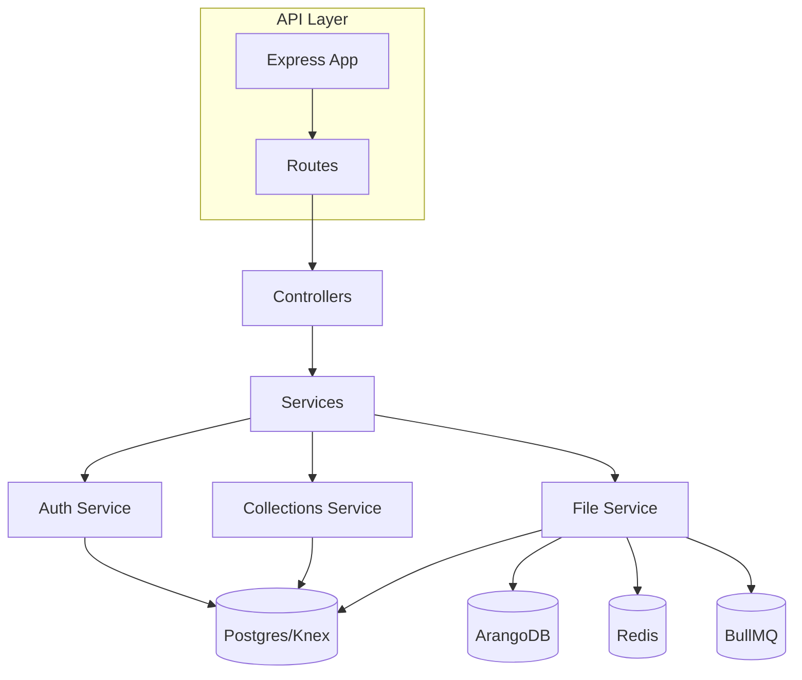

# Server Refactor Plan (Prioritized, ArangoDB in File Module)

## 1. Overview

This document outlines a comprehensive, prioritized refactor plan for the server codebase. The goals are to:
- Improve maintainability and clarity
- Reduce repetition and hardcoded values
- Make the codebase more approachable for newcomers
- Enforce clear separation between queries (data access) and services (business logic)
- Minimize risk by starting with the safest steps

---

## 2. Updated Server Architecture



**Explanation:**
- Only the file service uses ArangoDB, Redis, and BullMQ.
- Auth and collections use only Postgres.
- All ArangoDB logic (client, queries, service) is located within the file module (e.g., `src/modules/file/arangodb/`).
- If other modules need ArangoDB in the future, it can be refactored out.

---

## 3. Prioritized Refactor Steps

### **Priority 1: Documentation & Non-Code Changes (Safest)**
- Add a top-level `docs/` folder with this plan, architecture diagram, and onboarding guide.
- Add a high-level project README with quickstart, architecture, and contribution guide.
- Add per-module README files (including a section in the file module README for ArangoDB).
- Add comments and high-level docstrings to existing files.
- Document all environment variables in `.env.example` and per-module docs.

---

### **Priority 2: Centralization of Constants & Config**
- Move all table names, collection names, and ArangoDB/Postgres config to `src/config/constants.ts` or `src/config/arango.ts`.
- Refactor code to import these constants everywhere (no logic change, just imports).
- Ensure all ArangoDB config is referenced from a single config file and `.env`.

---

### **Priority 3: Utility Functions & Error Handling**
- Abstract repeated error handling (not found, conflict, forbidden) into helpers or middleware.
- Add utility functions for validation (e.g., Zod schemas for input).
- Refactor modules to use these utilities (minimal logic change, but some refactoring).

---

### **Priority 4: Module Structure & File Organization**
- Move all ArangoDB client, queries, and service logic into a subfolder of the file module (e.g., `src/modules/file/arangodb/`).
- Group embedding-related files into a subfolder if they grow large.
- For each module, ensure clear separation between queries and services, and document the boundary.
- Move/rename files as needed for clarity (no logic change, but may affect imports).

---

### **Priority 5: Refactor Code for Maintainability (Less Safe)**
- Refactor modules to use centralized config and utility functions.
- Refactor ArangoDB logic in the file module to use only centralized config.
- Refactor controllers to use Zod validation for all input.
- Refactor services to use new error handling and validation utilities.

---

### **Priority 6: Add/Refactor Tests (Requires Careful Validation)**
- Add example unit and integration tests for each module (auth, collections, file).
- Add a testing guide to the docs.
- Refactor existing tests to use new utilities and config.

---

### **Priority 7: Database Migration/Seeding Changes (Least Safe)**
- Move all table/column names to `database/constants.ts` and update migrations/seeds.
- Add comments and documentation to migration and seed files.
- Test migration and seeding process thoroughly after changes.

---

## 4. Module Overview & Refactor Plan

### 4.1. Auth Module

**Current:**
- `auth.controller.ts`, `auth.service.ts`, `auth.queries.ts`, `auth.types.ts`, `passport.config.ts`, `auth.routes.ts`, `auth.middleware.ts`

**Refactor Plan:**
- Keep clear separation between queries and service.
- Move all table names/constants to a shared config.
- Add a README explaining OAuth flow, session management, and file roles.
- Add Zod validation for all input at the controller level.
- Add high-level comments to each file.
- Add example unit tests for service and queries.

---

### 4.2. Collections Module

**Current:**
- `collections.controller.ts`, `collections.service.ts`, `collections.queries.ts`, `collections.types.ts`, `collections.routes.ts`, `index.ts`

**Refactor Plan:**
- Keep queries and service separate; document the boundary in README.
- Move table/join table names to shared config.
- Abstract repeated error handling (not found, conflict) into helpers.
- Add Zod validation for create/update inputs.
- Add comments explaining file linking logic and ownership checks.
- Add example integration test for collection CRUD and file linking.

---

### 4.3. File Module (with ArangoDB)

**Current:**
- `file.controller.ts`, `file.service.ts`, `file.queries.ts`, `file.schema.ts`, `chunking.strategies.ts`, `embedding.query.strategies.ts`, `embedding.search.queries.ts`, `file.embedding.queries.ts`, `file.embedding.service.ts`, `file.routes.ts`, `config.ts`, `index.ts`
- **ArangoDB logic will be moved here:** `file/arangodb/client.ts`, `file/arangodb/queries.ts`, `file/arangodb/service.ts`

**Refactor Plan:**
- Move all ArangoDB client, queries, and service logic into `src/modules/file/arangodb/`.
- Group embedding-related files into a subfolder if they grow large.
- Move all config/constants to shared config.
- Add README explaining chunking, embedding, file upload flow, and ArangoDB usage.
- Add Zod validation for file upload and embedding endpoints.
- Add comments to clarify chunking/embedding strategies and ArangoDB usage.
- Add example test for file upload, embedding, and ArangoDB graph operations.

**Sample File Module README Section for ArangoDB:**

```markdown
## ArangoDB Integration

All ArangoDB logic (client, queries, service) is located in `file/arangodb/`.
ArangoDB is used exclusively for file-related graph operations.
If other modules require ArangoDB in the future, consider refactoring it into a shared module.
```

---

### 4.4. Shared & Config

**Current:**
- `shared/config.ts`, `shared/errors.ts`, `config/constants.ts`, `config/environment.ts`, `config/database.ts`

**Refactor Plan:**
- Centralize all constants (table names, collection names, etc.) in `config/constants.ts`.
- Add README explaining the purpose of each shared/config file.
- Add utility functions for error handling and validation.

---

### 4.5. Database

**Current:**
- `database/connection.ts`, `database/constants.ts`, `database/migrations/`, `database/schemas/`, `database/scripts/`, `database/seeds/`

**Refactor Plan:**
- Move all table/column names to `database/constants.ts` and import where needed.
- Add README explaining migration/seeding process.
- Add comments to migration and seed files.

---

## 5. General Improvements

- Add a top-level `docs/` folder with this plan, architecture diagram, and onboarding guide.
- Add a high-level project README with quickstart, architecture, and contribution guide.
- Add per-module README files.
- Add more code comments and high-level docstrings.
- Add example tests and a testing guide.

---

## 6. Summary Table

| Priority | Step Description                                      | Risk Level   |
|----------|------------------------------------------------------|--------------|
| 1        | Documentation, comments, READMEs                     | Safest       |
| 2        | Centralize constants/config, update imports          | Very Safe    |
| 3        | Add utility functions, error handling, validation    | Safe         |
| 4        | File/folder organization, separation of concerns     | Safe         |
| 5        | Refactor code to use new config/utilities            | Moderate     |
| 6        | Add/refactor tests                                   | Moderate     |
| 7        | Migration/seeding changes                            | Least Safe   |

---

**Recommendation:**  
Proceed step-by-step, validating after each priority level. This minimizes risk and ensures the codebase remains stable and easy to review at each stage.

---
